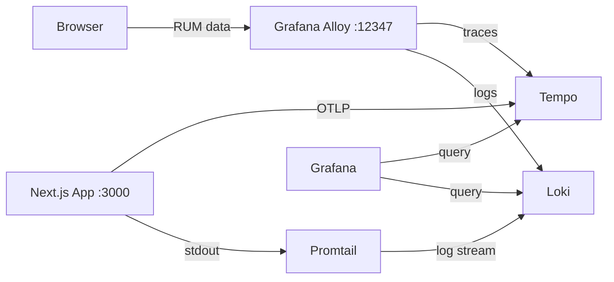

# Monitoring — MasakCook

A **Grafana**-based observability stack running on Docker, covering **frontend RUM** (via Faro), **backend tracing** (via OpenTelemetry/Tempo), and **log aggregation** (via Loki/Promtail).

## Architecture



| Service | Port | Description |
|---|---|---|
| **App** | `:3000` | Next.js app |
| **Alloy** | `:12347` | Unified collector with Faro receiver (RUM data from browser) |
| **Tempo** | `:3200` (:4317 gRPC, :4318 HTTP) | Tracing backend |
| **Loki** | `:3100` | Log aggregation |
| **Promtail** | — | Ships Docker logs to Loki |
| **Grafana** | `:3333` | Dashboard visualization |

## Prerequisites

- Docker & Docker Compose
- pnpm (for local builds)

## Setup

### 1. Build & Run All Services

```bash
DOCKER_BUILD=true docker compose up --build
```

Or step by step:

```bash
DOCKER_BUILD=true docker compose build app
docker compose up -d
```

### 2. Access

| Service | URL |
|---|---|
| App | http://localhost:3000 |
| Grafana | http://localhost:3333 |
| Tempo HTTP | http://localhost:3200 |
| Loki HTTP | http://localhost:3100 |

Grafana is pre-configured with **anonymous access** (admin) and auto-provisioned datasources/dashboards.

### 3. Verify

1. Open http://localhost:3000 — browse a few pages
2. Open http://localhost:3333 — go to **Dashboards > MasakCook - Observability**
3. Check the **Recent Traces** and **Log Volume** panels

## Components

### Frontend Observability (Faro)

File: `src/shared-components/FrontendObservability.tsx`

A client component that initializes the Grafana Faro Web SDK. Sends:
- **Web Vitals** (CLS, LCP, FID, INP)
- **Error tracking** (unhandled exceptions, promise rejections)
- **Session data** (page views, navigation)
- **Traces** (HTTP request tracing from the browser)

Endpoint configuration via env var:

```bash
NEXT_PUBLIC_FARO_COLLECTOR_URL=http://localhost:12347
NEXT_PUBLIC_APP_ENV=development
```

### Backend Tracing (OpenTelemetry + Tempo)

Files: `src/instrumentation.ts`, `src/middleware.ts`

Server-side tracing via `@vercel/otel` with:
- **Span cardinality reduction** — `/_next/static`, `/_next/data`, `/_next/image` are grouped
- **Server-Timing header** — traceparent in response headers for frontend↔backend correlation

Env vars:

```bash
OTEL_EXPORTER_OTLP_ENDPOINT=http://tempo:4318
OTEL_SERVICE_NAME=masakcook
```

### Grafana Alloy (Faro Receiver)

Config: `docker/alloy/config.alloy`

Grafana Alloy acts as the unified collector with a built-in Faro receiver. It receives Faro payloads from the browser, then:
- **Traces** → forwarded to Tempo via OTLP gRPC
- **Logs/Events** → forwarded to Loki via HTTP push

### Tempo

Config: `docker/tempo/tempo-config.yml`

Distributed tracing backend with 24-hour retention. Receives data from:
- Alloy (frontend traces via Faro receiver)
- Next.js app (backend traces via OTLP HTTP)

### Loki + Promtail

Config: `docker/loki/loki-config.yml`, `docker/promtail/promtail-config.yml`

Loki stores logs with 7-day retention. Promtail scrapes logs from all Docker containers via the Docker socket.

### Grafana

Provisioning: `docker/grafana/datasources/`, `docker/grafana/dashboards/`

Auto-configured datasources:
- **Tempo** — linked to Loki for trace→logs navigation
- **Loki** — derived fields for logs→trace linking

Dashboard **MasakCook - Observability** with panels:
- Services overview
- Log volume per container (30m)
- Recent traces table
- Trace duration chart (p95)

## Environment Variables

See `.env.example`:

```bash
# Faro Collector (self-hosted via Docker)
NEXT_PUBLIC_FARO_COLLECTOR_URL=http://localhost:12347
NEXT_PUBLIC_APP_ENV=development

# OpenTelemetry - Backend tracing to Tempo
OTEL_EXPORTER_OTLP_ENDPOINT=http://tempo:4318
OTEL_SERVICE_NAME=masakcook
```

## Docker

### Project Structure

```
docker/
├── alloy/
│   └── config.alloy
├── grafana/
│   ├── datasources/
│   │   └── datasources.yml
│   └── dashboards/
│       ├── dashboards.yml
│       └── masakcook.json
├── loki/
│   └── loki-config.yml
├── promtail/
│   └── promtail-config.yml
└── tempo/
    └── tempo-config.yml
```

### Useful Commands

```bash
# View logs from all services
docker compose logs -f

# View logs from a specific service
docker compose logs -f app
docker compose logs -f tempo

# Restart a specific service
docker compose restart grafana

# Remove all data volumes
docker compose down -v

# Rebuild only the app
DOCKER_BUILD=true docker compose build app
```

## Troubleshooting

**Grafana cannot query Tempo**
Make sure Tempo is running: `docker compose ps tempo`. Check logs: `docker compose logs tempo`.

**Faro data not showing in Grafana**
1. Open browser DevTools > Network, filter by `collect`
2. Verify there are POST requests to `http://localhost:12347/collect`
3. Check Alloy logs: `docker compose logs alloy`

**OTLP traces from backend not arriving**
1. Verify the `OTEL_EXPORTER_OTLP_ENDPOINT` env var is set
2. Check connectivity: `docker compose exec app wget -qO- http://tempo:4318`
3. Check app logs: `docker compose logs app`

**Port conflict**
Change the port mapping in `docker-compose.yml`:
```yaml
services:
  grafana:
    ports:
      - "3334:3000"  # change 3333 → 3334
```
