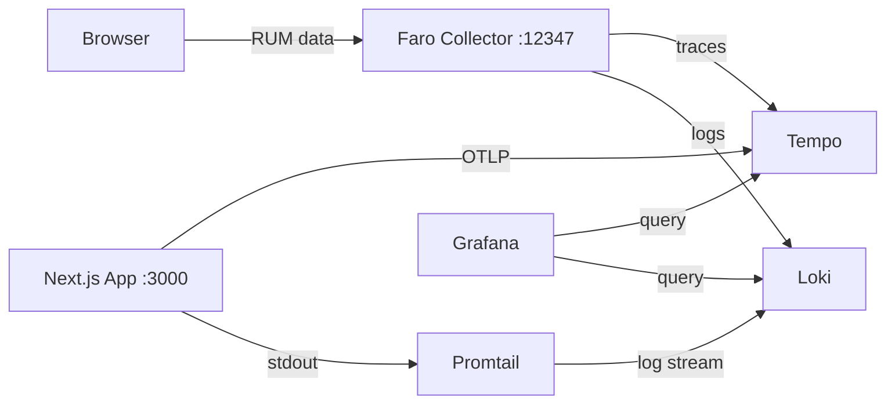

# Monitoring — MasakCook

Stack observability berbasis **Grafana** yang berjalan di Docker, mencakup **frontend RUM** (via Faro), **backend tracing** (via OpenTelemetry/Tempo), dan **log aggregation** (via Loki/Promtail).

## Arsitektur



| Service | Port | Fungsi |
|---|---|---|
| **App** | `:3000` | Next.js app |
| **Faro Collector** | `:12347` | Terima RUM dari browser (web vitals, errors, traces) |
| **Tempo** | `:3200` (:4317 gRPC, :4318 HTTP) | Tracing backend |
| **Loki** | `:3100` | Log aggregation |
| **Promtail** | — | Ship Docker logs ke Loki |
| **Grafana** | `:3333` | Dashboard visualisasi |

## Prerequisites

- Docker & Docker Compose
- pnpm (untuk build lokal)

## Setup

### 1. Build & Jalankan Semua Service

```bash
DOCKER_BUILD=true docker compose up --build
```

Atau bertahap:

```bash
DOCKER_BUILD=true docker compose build app
docker compose up -d
```

### 2. Akses

| Service | URL |
|---|---|
| Aplikasi | http://localhost:3000 |
| Grafana | http://localhost:3333 |
| Tempo HTTP | http://localhost:3200 |
| Loki HTTP | http://localhost:3100 |

Grafana sudah terkonfigurasi dengan **anonymous access** (admin) dan datasource/dashboard auto-provisioning.

### 3. Verifikasi

1. Buka http://localhost:3000 — jalanin beberapa halaman
2. Buka http://localhost:3333 — masuk ke **Dashboards > MasakCook - Observability**
3. Cek panel **Recent Traces** dan **Log Volume**

## Komponen

### Frontend Observability (Faro)

File: `src/shared-components/FrontendObservability.tsx`

Client component yang menginisialisasi Grafana Faro Web SDK. Mengirim:
- **Web Vitals** (CLS, LCP, FID, INP)
- **Error tracking** (unhandled exceptions, promise rejections)
- **Session data** (page views, navigation)
- **Traces** (HTTP request tracing dari browser)

Konfigurasi endpoint via env var:

```bash
NEXT_PUBLIC_FARO_COLLECTOR_URL=http://localhost:12347
NEXT_PUBLIC_APP_ENV=development
```

### Backend Tracing (OpenTelemetry + Tempo)

File: `src/instrumentation.ts`, `src/middleware.ts`

Server-side tracing via `@vercel/otel` dengan:
- **Span cardinality reduction** — `/_next/static`, `/_next/data`, `/_next/image` di-group
- **Server-Timing header** — traceparent di-response header untuk korelasi frontend↔backend

Env vars:

```bash
OTEL_EXPORTER_OTLP_ENDPOINT=http://tempo:4318
OTEL_SERVICE_NAME=masakcook
```

### Faro Collector

Config: `docker/faro-collector/collector-config.yml`

Menerima payload Faro dari browser, lalu:
- **Traces** → diteruskan ke Tempo (OTLP gRPC)
- **Logs/Events** → diteruskan ke Loki (HTTP push)

### Tempo

Config: `docker/tempo/tempo-config.yml`

Distributed tracing backend dengan retention 24 jam. Menerima data dari:
- Faro Collector (frontend traces)
- Next.js app (backend traces via OTLP HTTP)

### Loki + Promtail

Config: `docker/loki/loki-config.yml`, `docker/promtail/promtail-config.yml`

Loki menyimpan logs dengan retention 7 hari. Promtail meng-scrape log dari semua container Docker via Docker socket.

### Grafana

Provisioning: `docker/grafana/datasources/`, `docker/grafana/dashboards/`

Datasource auto-configured:
- **Tempo** — link ke Loki untuk trace→logs
- **Loki** — derived fields untuk logs→trace

Dashboard **MasakCook - Observability** dengan panel:
- Services overview
- Log volume per container (30m)
- Recent traces table
- Trace duration chart (p95)

## Environment Variables

Lihat `.env.example`:

```bash
# Faro Collector (self-hosted via Docker)
NEXT_PUBLIC_FARO_COLLECTOR_URL=http://localhost:12347
NEXT_PUBLIC_APP_ENV=development

# OpenTelemetry - Backend tracing ke Tempo
OTEL_EXPORTER_OTLP_ENDPOINT=http://tempo:4318
OTEL_SERVICE_NAME=masakcook
```

## Docker

### Project Structure

```
docker/
├── faro-collector/
│   └── collector-config.yml
├── grafana/
│   ├── datasources/
│   │   └── datasources.yml
│   └── dashboards/
│       ├── dashboards.yml
│       └── masakcook.json
├── loki/
│   └── loki-config.yml
├── promtail/
│   └── promtail-config.yml
└── tempo/
    └── tempo-config.yml
```

### Perintah Berguna

```bash
# Lihat log semua service
docker compose logs -f

# Lihat log service tertentu
docker compose logs -f app
docker compose logs -f tempo

# Restart service tertentu
docker compose restart grafana

# Hapus semua data volumes
docker compose down -v

# Build ulang app aja
DOCKER_BUILD=true docker compose build app
```

## Troubleshooting

**Grafana tidak bisa query Tempo**
Pastikan Tempo sudah running: `docker compose ps tempo`. Cek log: `docker compose logs tempo`.

**Faro data tidak muncul di Grafana**
1. Buka browser DevTools > Network, filter `collect`
2. Pastikan ada POST ke `http://localhost:12347/collect`
3. Cek log Faro collector: `docker compose logs faro-collector`

**OTLP trace dari backend tidak sampai**
1. Cek env var `OTEL_EXPORTER_OTLP_ENDPOINT` sudah di-set
2. Cek koneksi: `docker compose exec app wget -qO- http://tempo:4318`
3. Cek log app: `docker compose logs app`

**Port bentrok**
Ubah port mapping di `docker-compose.yml`:
```yaml
services:
  grafana:
    ports:
      - "3334:3000"  # ganti 3333 → 3334
```
